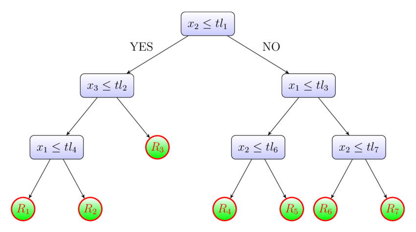
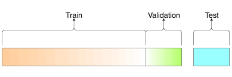
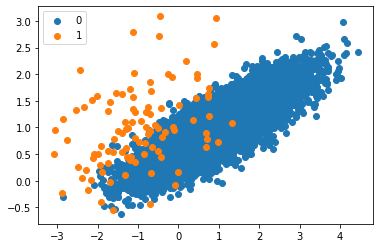
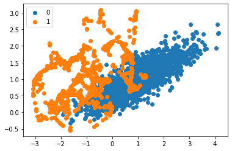

# [Group4] Bankrutcy Prediciton

### 組員
* 鄭宇傑, 108703014
* 賴冠瑜, 108703019
* 張瀚文, 108304003
* 江宗樺, 108703029
* 田詠恩, 108703030
### 目標
95% 以上的資料中的公司都沒有破產(Bankruptcy == 0)
所以全部猜 1 就可以有超級高的 Accuracy
我們將目標設定成要盡可能增加 recall 。嘗試預測出更多可能會倒的公司去對他們做關切 或提早做應對措施，並去檢視可能面臨的問題，是這次專題的主要目標。
### Demo 
* [ShinyApp](https://yjack0000.shinyapps.io/shinyui/?_ga=2.142920117.1862022445.1641973117-1531152518.1641397296)
* Rscript 使用
```R
Rscript code/your_script.R --input data/training --output results/performance.tsv
```

## 檔案架構及其相關資訊

### docs
* [Google Slide for Presentation](https://docs.google.com/presentation/d/1TWPNksUenzi-DsquO6Yv7WBCVPvZE-HgyjMmvAcAH3U/edit#slide=id.g10d591fe8d9_0_169)

### data

* [來源](https://www.kaggle.com/fedesoriano/company-bankruptcy-prediction)
* [格式](https://github.com/1101-datascience/finalproject_group4/tree/main/data)
* 預處理
  * 資料分析
  * PCA
  * Normalize

### code

* method we use
  * decision tree

    
  * random forest

    
  * logistic regression 

    
  * cnn


* Null model predict all 1
* data split

  


* 使用 SMOTE 製作額外的 traning data

  
  

### results

* Which metric do you use 
  * precision, recall, R-square
* Is your improvement significant?
* challenge part of project
  * unbalance of data make prediction more difficult
  * tuning of hyperparameters
  * testing of different epoch
  * choose between precision and recall

## References
https://www.kaggle.com/jerryfang5/bankrutcy-prediciton-by-r/notebook
https://www.kaggle.com/seongwonr/bankruptcy-prediction-with-smote
https://colab.research.google.com/drive/12wXAyrbX8Ji5J6CNAEIQwtDOaxy8BCIO?usp=sharing
