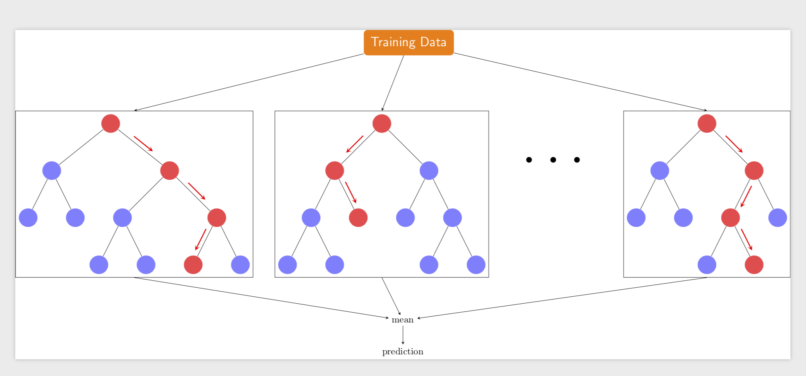
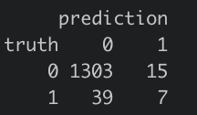
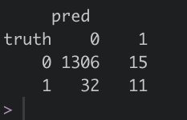
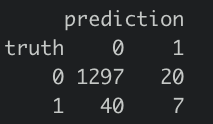
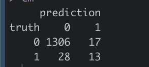

# [Group4] Bankrutcy Prediciton

### 組員
* 鄭宇傑, 108703014
* 賴冠瑜, 108703019
* 張瀚文, 108304003
* 江宗樺, 108703029
* 田詠恩, 108703030
### 目標
95% 以上的資料中的公司都沒有破產(Bankruptcy == 0)
所以全部猜 1 就可以有超級高的 Accuracy
我們將目標設定成要盡可能增加 recall 。嘗試預測出更多可能會倒的公司去對他們做關切 或提早做應對措施，並去檢視可能面臨的問題，是這次專題的主要目標。
### Demo 
* [ShinyApp](https://yjack0000.shinyapps.io/shinyui/?_ga=2.142920117.1862022445.1641973117-1531152518.1641397296)
* Rscript 使用
```R
Rscript code/your_script.R --input data/training --output results/performance.tsv
```

## 檔案架構及其相關資訊

### docs
* [Google Slide for Presentation](https://docs.google.com/presentation/d/1TWPNksUenzi-DsquO6Yv7WBCVPvZE-HgyjMmvAcAH3U/edit#slide=id.g10d591fe8d9_0_169)

### data

* [來源](https://www.kaggle.com/fedesoriano/company-bankruptcy-prediction)
* [格式](https://github.com/1101-datascience/finalproject_group4/tree/main/data)
* 預處理
  * 資料分析
  * PCA
  * Normalize

### code

* method we use
  * decision tree
  ```console
  
  ```

    
  * random forest
  ```console
  
  ```
  
    
  * logistic regression 
  ```console
  
  ```

    
  * cnn


* Null model predict all 1
* data split

  


* 使用 SMOTE 製作額外的 traning data

  
  

### results

* use precision accuracy and recall to evaluate model
* improvement
  1. 用pca 分析並使用前40個主成份 
  2. 利用k-fold validation的方法 篩選出recall最高的model
  3. 對於threshold、max depth等超參數進行調整

* decision tree
  ```r
  model<- rpart( Bankrupt. ~ .,
              data=res[["train"]],
              control=rpart.control(maxdepth=20),
              method="class")


  trainframe <- data.frame(truth=res[["train"]]$Bankrupt.,
                          pred=predict(model, type="class"))

  TP.train<-nrow(filter(trainframe, truth == pred , truth == 1,))
  TN.train<-nrow(filter(trainframe, truth == pred , truth == 0,))
  FP.train<-nrow(filter(trainframe, truth != pred , truth == 0,))
  FN.train<-nrow(filter(trainframe, truth != pred , truth == 1,))
  accuracy.train<-(TP.train+TN.train)/nrow(trainframe)
  fallback.train<-(TP.train)/(TP.train+FN.train)
  precision.train<-(TP.train)/(TP.train+FP.train)
  NegativePrecision.train<-(TN.train)/(TN.train+FN.train)
  ```

    

* random forest

  ```r
  g = sample(cut(
            seq(nrow(data)), 
            nrow(data)*cumsum(c(0,spec)),
            labels = names(spec)
            ))

  # final data
  res = split(data, g)


  #train pca
  in_d <- res[["train"]]
  in_d = in_d[,!colnames(in_d) %in% c('Net.Income.Flag','Bankrupt.')]
  pca <- prcomp(in_d, center=TRUE, scale=TRUE)

  #--- watch pc
  std_dev <- pca$sdev 
  pr_var <- std_dev^2
  prop_varex <- pr_var/sum(pr_var)
  #plot(prop_varex, type = 'lines')


  #--- built train data with Bankrupt and top 40 component
  train.data <- data.frame(Bankrupt. = res[["train"]]$Bankrupt., pca$x)
  train.data <- train.data[,1:41]
  train.data.var <- colnames(train.data[,2:40])

  #--- built val data with Bankrupt and top 40 component
  val.data <- predict(pca, newdata = res[["validate"]]) 
  ```

    

* logistic regression
  ```r
  model <- glm(formula = Bankrupt. ~ . ,
				 family = binomial(link='probit'),
				 epsilon = 1e-14,
				 data = train.data)

	# val data
	val.data <- predict(pca, newdata = res[["validate"]]) 
	val.data <- as.data.frame(val.data)
	val.data <- val.data[,1:40]


	# data frame of val
	val <- data.frame(truth = res[["validate"]]$Bankrupt.,
					  prediction = predict(model, val.data))
	val <- mutate(val, pred = ifelse(prediction > ts, 1, 0))

	# confusion matrix of validation
	cm <- table(val[,c(1,3)])
  ```
  
    
* cnn 
  ```python
  class BinaryClassification(nn.Module):
    def __init__(self):
        super(BinaryClassification, self).__init__()
        # Number of input features is 12.
        self.layer_1 = nn.Linear(95, 200) 
        self.layer_2 = nn.Linear(200, 64)
        self.layer_out = nn.Linear(64, 1) 
        
        self.relu = nn.ReLU()
        self.dropout = nn.Dropout(p=0.5)
        self.batchnorm1 = nn.BatchNorm1d(200)
        self.batchnorm2 = nn.BatchNorm1d(64)
        
    def forward(self, inputs):
        x = self.relu(self.layer_1(inputs))
        x = self.batchnorm1(x)
        x = self.relu(self.layer_2(x))
        x = self.batchnorm2(x)
        x = self.dropout(x)
        x = self.layer_out(x)
        
        return x
  ```

  

* 較有挑戰性的部分
  * 訓練資料中不平均（大多都沒有倒閉）
  * tuning of hyperparameters
  * testing of different epoch
  * choose between precision and recall


## References
https://www.kaggle.com/jerryfang5/bankrutcy-prediciton-by-r/notebook
https://www.kaggle.com/seongwonr/bankruptcy-prediction-with-smote
https://colab.research.google.com/drive/12wXAyrbX8Ji5J6CNAEIQwtDOaxy8BCIO?usp=sharing
