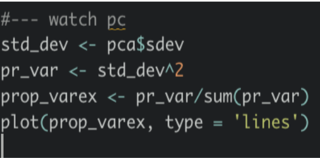

# Company Bankrutcy Prediciton

Data Science Final Presentation Group 4

### 2022-01-13

---

# Group Members

Group4：
108703014 鄭宇傑
108703019 賴冠瑜
108703029 江宗樺
108703030 田詠恩
108304003 張瀚文

---

# 資料介紹

1999 年至 2009 年數據來自自台灣經濟日報的統計。公司破產之定義為台灣證券交易所的業務規則而定。

---

# 屬性資訊

- X2 - ROA(A) before interest and % after tax: Return On Total Assets(A)
- X11 - Operating Expense Rate: Operating Expenses/Net Sales
- X13 - Cash flow rate: Cash Flow from Operating/Current Liabilities
- X33 - Current Ratio
- X92 - Degree of Financial Leverage (DFL)

- X85 - Liability-Assets Flag: 1 if Total Liability exceeds Total Assets, 0 otherwise
- X94 - Net Income Flag: 1 if Net Income is Negative for the last two years, 0 otherwise

---

# 資料分析

## Shiny App

## 相關係數

該圖顯示了每個特徵對於對方的相關性。圖中 x 及 y 軸為資料的屬性，格子中的顏色越深，代表著兩屬性之間的相關性越高。

## 相關係數

該圖顯示了每個特徵對於對方的相關性。圖中 x 及 y 軸為資料的屬性，格子中的顏色越深，代表著兩屬性之間的相關性越高。

## 主成份分析

從第一主成份(PC1)到第二主成份(PC2)可以發現沒有明顯可以分辨破產與否的成分。

## 資料解釋度

我們可以看到大約 40 個主成份就解釋了超過 90%的差異。

## 公司破產分佈

## 模型評估標準

- 95% 以上的資料中的公司都沒有破產(Bankruptcy == 0)
  所以全部猜 1 就可以有超級高的 Accuracy (NULL model)

- 我們將目標設定成要盡可能增加 recall 。
  嘗試預測出更多可能會倒的公司去對他們做關切或提早做應對措施，並去檢視可能面臨的問題，是這次專題的主要目標。

---

# Models

## pca 分析 -> 取前 40 個

## model #1: rpart decision tree

| decision tree                                          | decision tree with pca                                    |
| ------------------------------------------------------ | --------------------------------------------------------- |
|  |  |
|               |                      |

## model #2: random forest

| random forest                                          | decision tree with pca                                    |
| ------------------------------------------------------ | --------------------------------------------------------- |
|  |  |
|                   |                  |

## model #3: logistic regression

| logistic regression                                          | logistic regression with pca                                    |
| ------------------------------------------------------------ | --------------------------------------------------------------- |
|  |  |
|                   |                  |

---

# SMOTE 生成資料

# Pytorch

## epoch 次數比較

| epoch 1-10                         | epoch 10-150                         |
| ---------------------------------- | ------------------------------------ |
|  |  |

---

# 總結

| recall                     | 原始資料 | 透過 PCA 降維處理 |
| -------------------------- | -------- | ----------------- |
| Decision Tree              | 0.15     | 0.26              |
| Random Forest              | 0.36     | 0.15              |
| Logistic Regression        | 0.32     | 0.63              |
| Convolution Neural Network | 0.68     | 0.78              |

---

# 問題與討論

- 資料面?
  - 資料的收集
  - 資料的真實性
- 模型面?
  - 資料數量
  - 對未來預測的時效性

---

# Reference

https://www.kaggle.com/jerryfang5/bankrutcy-prediciton-by-r/notebook
https://www.kaggle.com/seongwonr/bankruptcy-prediction-with-smote
https://colab.research.google.com/drive/12wXAyrbX8Ji5J6CNAEIQwtDOaxy8BCIO?usp=sharing

---

- [Google Slide for Presentation](https://docs.google.com/presentation/d/1TWPNksUenzi-DsquO6Yv7WBCVPvZE-HgyjMmvAcAH3U/edit#slide=id.g10d591fe8d9_0_169)
